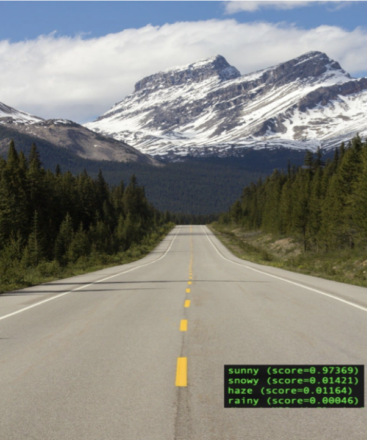
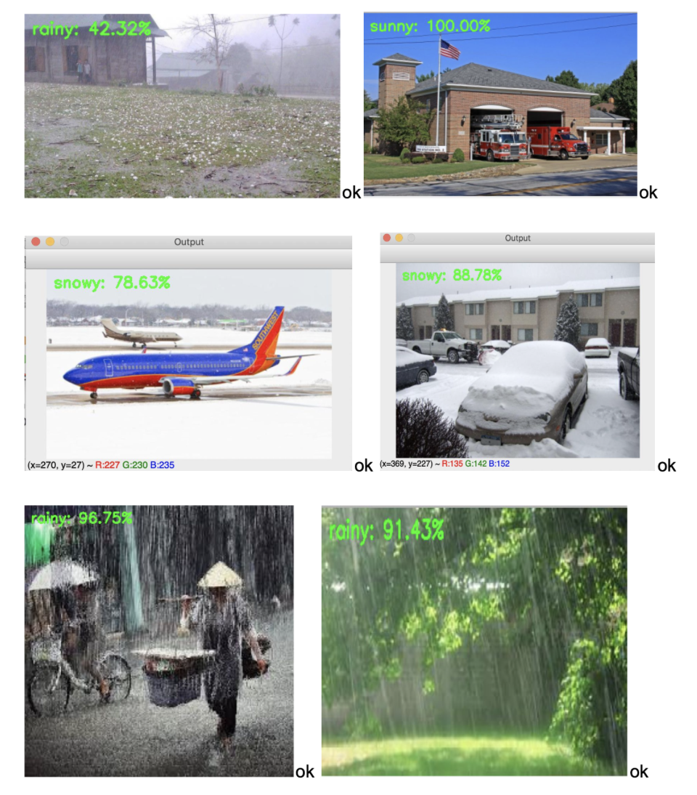

# ImageClassification
Image Classification Task thanks to Transfer Learning and Convolutional Neural Networks.

# GOAL: Weather Classification

The goal is to use two different tools to achieve the same goal, estimating which tool was better (CNN vs Transfer Learning). The same image dataset was used for both experiments.

# Approach
The approach for both experiments is described into the "report.pdf"

# Results
For both experiments I got very good results as following

The final conclusion was that transfer learning works better for these types of tasks and that thanks to this it was possible to achieve very high accuracy (solving some problems that were instead encountered with the previous cnn).

